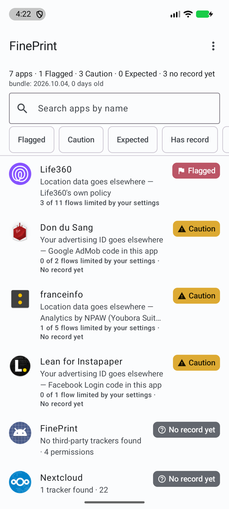
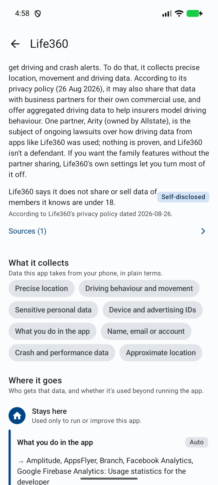
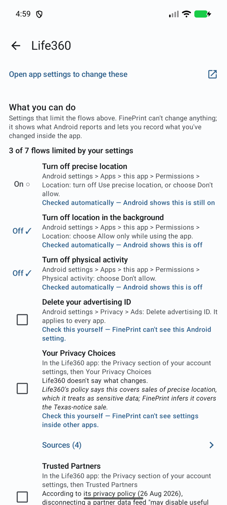

# FinePrint

Your phone already tells you *which* permissions an app has. FinePrint tells you
where the data goes once it has them.

For each installed app, FinePrint shows the third-party tracker SDKs embedded in
it, who owns those trackers, what they sell and to whom, and why that could matter
to you in real terms — with a source for every claim and a button to the settings
page where you can revoke access. The reference case: Life360 says "Location:
allowed." FinePrint says "driving data → Arity SDK → Allstate → sold to insurers
for risk scoring (alleged in a 2025 Texas AG lawsuit) — tap here to revoke."

No accounts. No telemetry. No server that ever learns what's on your phone: the
knowledge base is a single JSON file the app downloads whole and reads locally.
Android first; iOS via App Privacy Report import later. Free, open source, and
supported by exactly one hardcoded ad that knows nothing about you.

## Screenshots

|  |  |  |
|:---:|:---:|:---:|

Android emulator, October 2026. Records change as the knowledge base is reviewed; see bundle/ for the current data.

## Layout

- `bundle/` — the knowledge base: `schema.json` (the contract) and `bundle.json` (reviewed, sourced records). CC BY 4.0.
- `pipeline/` — Python scripts that fetch sources, draft records with an LLM, queue them for human review, and build the bundle. Runs on a Mac Mini.
- `android/` — Kotlin / Jetpack Compose app. The scanning module is called `egress`.
- `prompts/` — Claude Code prompts for each build slice.

## Before committing

```sh
brew install pre-commit && pre-commit install   # pre-commit and pre-push hooks
pre-commit run --all-files
```

The hooks run `gitleaks`, block keystores, `local.properties`, `.env` and anything in
`pipeline/raw/` or `pipeline/drafts/`, and fail on macOS home-directory paths, Tailscale addresses
and host names, and mDNS host names (patterns in `tools/check_private.py`). Private strings such as your own
email go one per line in `.git/private-patterns`: that file is never committed, so the strings it
guards stay out of the repo too.

Owner's manual steps on GitHub: turn on secret scanning push protection (Settings → Code security),
and commit with the GitHub noreply address (`git config user.email <id>+<user>@users.noreply.github.com`).

## Status

G1 and G2 are signed off on an Android 17 emulator, and G3 is pushed to `main`:

- G1, the scanner: installed apps, their permissions and the tracker SDKs in their code (Arity in
  Life360).
- G2, the knowledge bundle: downloaded whole, and a data-first explanation per app, every claim
  sourced. Life360 is the one record in it today.
- G3, the UI pass: tiers by a published formula (`docs/METHOD.md`), the same sections with their
  definitions on every page, a Sources sheet, How to read this, Reviewed marks and the "What you
  can do" checklist, with tap targets of 48dp or more enforced by a test.

A real-device check and the Tailscale path are deferred by choice. See `CLAUDE.md` for the gates.

Pending: PR #1 (`kb/records`) adds reviewed records for Facebook, TikTok and Google Maps, with
company records for Meta, ByteDance and Google; CI (pipeline tests, record validation and an
Android debug build); and source-check tooling. Its checks pass; it isn't merged yet.

Next, in order:

1. Merge PR #1, rebuild the bundle with the three records, and check them on the emulator
   (expected tiers: Facebook Flagged, TikTok Flagged, Google Maps Caution).
2. A company-history section under On the record, so that a summary sentence about a company's
   past (Google Maps') has the company's record behind it.
3. Schema v1.3: `covers[]` (one tracker explanation for several Exodus ids), `changes[]` with a
   direction, a `government_body` recipient kind, and `policy_region`.
4. A design pass.

Logged for later (not built yet):
- Government access. For each flow, show which governments can obtain the data and how, with one
  rule for every government. Three line types, each with the usual status badge and sources: "Can
  compel" (a company in jurisdiction X is subject to law Y; cite the statute), "Has bought" (a
  documented government purchase of this kind of data: DHS OIG 2023, the FTC's X-Mode and Gravy
  orders) and "Has used" (documented government use; two sources, reported). Needs schema v1.3: a
  recipient kind `government_body` and a per-jurisdiction statute table. A "What matters to me"
  setting lets the user choose which jurisdictions and mechanisms to highlight. FinePrint never
  ranks governments; it ranks evidence. Three claims always stay distinct: headquartered in X,
  subject to X's law, servers in X. The principle is in `docs/METHOD.md` ("Governments").

## Licence

Code: AGPL-3.0-or-later. Data in `bundle/`: CC BY 4.0. Tracker signatures
(`android/app/src/main/assets/trackers.json`) are derived from the [εxodus](https://exodus-privacy.eu.org/)
tracker database and are under the Open Database License (ODbL) 1.0.
