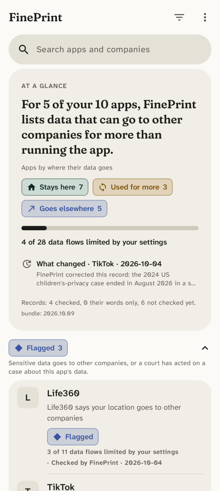
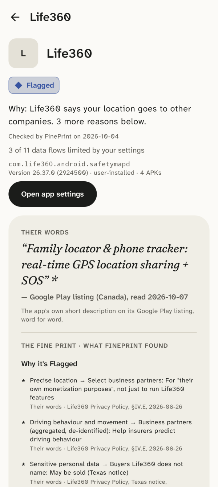

# FinePrint

Your phone already tells you *which* permissions an app has. FinePrint tells you
where the data goes once it has them.

For each installed app, FinePrint shows the third-party tracker SDKs embedded in
it, who owns those trackers, what they sell and to whom, and why that could matter
to you in real terms — with a source for every claim and a button to the settings
page where you can revoke access. The reference case: Life360 says "Location:
allowed." FinePrint says "driving data → Arity SDK → Allstate → sold to insurers
for risk scoring (alleged in a 2025 Texas AG lawsuit) — tap here to revoke."

No accounts. No telemetry. No server that ever learns what's on your phone: the
knowledge base is a single JSON file the app downloads whole and reads locally.
Android first; iOS via App Privacy Report import later. Free, open source, and
supported by exactly one hardcoded ad that knows nothing about you.

## Screenshots

<p>
  
  
</p>

Drawn by the screenshot tests (`./gradlew readmeScreenshots`), never by hand, from knowledge bundle 2026.10.09
and the scan fixture: the test emulator's apps, plus Google Maps, which has a record but isn't installed there.
In dark mode: [the home](docs/screenshots/home-dark.png) and [Life360](docs/screenshots/detail-dark.png).

## Preview build

A debug build for browsing FinePrint on any phone as it evolves, installed beside the real app. It shows the
sample apps in the scan fixture with the knowledge bundle built in. It scans nothing on the phone and makes no
network calls: its manifest has no internet or package-query permission, and Open app settings is turned off.

- Build it: `cd android && ./gradlew assemblePreviewDebug`; the APK is
  `android/app/build/outputs/apk/preview/debug/app-preview-debug.apk`.
- Or download it: every CI run keeps it for 30 days as the `fineprint-preview` artifact, a zip on the run's page
  under Actions (signed-in GitHub users only). It's never attached to a release.
- Sideload it: copy the APK to the phone and open it, letting your browser or file manager install unknown apps
  when asked (or `adb install` it). It installs as FinePrint preview (`com.longlifeio.fineprint.preview`), with
  its own Reviewed marks.
- It's debug-signed, so Play Protect warns that it comes from an unknown developer.

## Layout

- `bundle/` — the knowledge base: `schema.json` (the contract), `bundle.json` (reviewed, sourced records) and `jurisdictions.json` (each country's laws for compelled access). CC BY 4.0.
- `pipeline/` — Python scripts that fetch sources, draft records with an LLM, queue them for human review, and build the bundle. Runs on a Mac Mini.
- `android/` — Kotlin / Jetpack Compose app. The scanning module is called `egress`. Two flavours: `device`, the
  app itself, and `preview` (above), whose code lives only in `src/preview`.
- `prompts/` — Claude Code prompts for each build slice.

## Before committing

```sh
brew install pre-commit && pre-commit install   # pre-commit and pre-push hooks
pre-commit run --all-files
```

The hooks run `gitleaks`, block keystores, `local.properties`, `.env` and anything in
`pipeline/raw/` or `pipeline/drafts/`, and fail on macOS home-directory paths, Tailscale addresses
and host names, and mDNS host names (patterns in `tools/check_private.py`). Private strings such as your own
email go one per line in `.git/private-patterns`: that file is never committed, so the strings it
guards stay out of the repo too.

Owner's manual steps on GitHub: turn on secret scanning push protection (Settings → Code security),
and commit with the GitHub noreply address (`git config user.email <id>+<user>@users.noreply.github.com`).

## Status

G1 to G3 are signed off on an Android 17 emulator, G5 is built, and the schema is at v1.7:

- G1, the scanner: installed apps, their permissions and the tracker SDKs in their code (Arity in
  Life360).
- G2, the knowledge bundle: downloaded whole, and a data-first explanation per app, every claim
  sourced. Reviewed records for Life360, Facebook, TikTok and Google Maps, with company records for
  the companies behind them.
- G3, the UI pass: tiers by a published formula (`docs/METHOD.md`), the same sections with their
  definitions on every page, a Sources sheet, How to read this, Reviewed marks and the "What you
  can do" checklist, with tap targets of 48dp or more enforced by a test.
- G5, the design pass: the Field notes design system on the home, the detail screen and a
  three-page introduction, with colour only on tier and bucket chips and its contrast and
  colour-blind separation enforced by a test. The detail screen opens with "Their words", the app's
  Play listing short description quoted verbatim, then the fine print. Screenshot tests draw the
  home, Life360, its Sources sheet, How to read this and the introduction, light and dark, at 150%
  and 200% text and on a small phone and a tablet (and the README's images); every device test runs
  the accessibility checks, and TalkBack was checked on the emulator.
- Schema v1.3: one tracker record covers several Exodus ids (`covers[]`); a record's history, with
  the direction of each change (`changes[]`); ongoing and past legal actions, where only ongoing
  or recent ones set a tier; government access, with a reviewed table of laws per country
  (`bundle/jurisdictions.json`) and where each company is based; a policy's region; flows that are
  off by default or opt-in; and apps that came with the phone showing their maker's policy lines.
- Schema v1.4 and v1.5: `store_tagline` on app records (Life360, Facebook and TikTok, quote-checked
  against the saved listing); every flow has an id; and a record's changes, like Reviewed marks,
  count rulings, lawsuits and a flow's evidence, never wording.
- Schema v1.6 and v1.7: when FinePrint checked an app (Checked by FinePrint, or Their words only);
  whether a claim is before a court or a regulator, and a regulator's formal proceeding; flows that
  hang on a setting FinePrint can't see (shown, never scored); a tracker's sourced purpose; and a
  short line for each law, shown first, with the law's full text opening under it.
- The reading pass: plain words throughout, with a Voice section in `docs/METHOD.md` and a
  readability report on every build (CI warns, never fails); under each app's name, the reason for
  its tier ("Why: Life360 says your location goes to other companies"), with what set it listed
  first under "Why it's Flagged"; a search bar on the home; and an edge on every card in dark mode.
- The laws table, reviewed entry by entry: eight laws in force (the US, Canada, China, the EU,
  Israel and Russia), each with who it binds, whether the company may tell you it handed data
  over, its own review date and a Stale marker; an EU regulation is keyed to the member states it
  binds. Laws that bind only licensed telecoms, or that permit disclosure rather than compel it,
  are parked as drafts.
- The watcher (`pipeline/watch.py`): it re-reads every quoted page weekly and two regulators' feeds
  daily, and queues what changed for a person to review; it never edits a record.

A real-device check and the Tailscale path are deferred by choice. See `CLAUDE.md` for the gates.

Next, in order:

1. Tracker records for common SDKs (`kb/trackers`). Company records there need `jurisdiction` and
   `jurisdiction_sources` (schema v1.3), and every flow an id (v1.5), before they merge.
2. G6: guided paths and Guide mode.
3. A test on a phone.

Logged for G6 (not built yet):
- Guided paths. Each in-app control gets `path.steps[]` (screen → the exact label to tap, verbatim
  from the company's help page → what it changes), shown inside FinePrint as swipeable step cards
  with generic grey wireframe thumbnails and the target row highlighted: no replicas of other apps'
  screens and no logos; the app's own icon from the device is the only brand mark. Each path ends
  in the real deep link or `settings_url`. Steps carry `help_url`, quotes under the usual rule and
  `verified_on` {app_version, date}; help-page changes go through the diff job and the stale flag.
  Fallback steps for screens that have changed ("If you don't see Privacy, tap Search in Settings
  and type 'privacy choices'"). First batch: the ten most useful controls across Google's ad
  settings, Meta's ad preferences and off-Facebook activity, TikTok's personalization and Life360's
  three.
- Guide mode. The same steps as a small, movable floating card (Next / Back / Done) over the real
  app while the user moves through it themselves. Draw-only: it needs only the overlay permission,
  reads nothing, captures nothing, has no input fields, and is opt-in per walkthrough, never
  persistent. Permission prompt: "This lets FinePrint show step cards over other apps. It cannot
  see what's on your screen." The deep link makes the first jump; the user moves on by tapping
  Next; Done, or going back to FinePrint, closes the card and offers to tick the control with
  today's date. How to read this explains why FinePrint's use of an overlay differs from the
  device-access warning about overlays. For Play: declare the overlay permission's purpose. Never
  in scope: a sandbox copy of another app with a test account, or any Accessibility-based
  highlighting.

Schema items queued: `settings_url` on controls; `controls[].path.steps[]`, `help_url` and
`verified_on`.

Queued: laws to review (not started):
- Ireland's domestic powers over companies based there: its e-Evidence implementing act and the
  warrant or production powers Gardaí use.
- US national law beyond the CLOUD Act and FISA: the Stored Communications Act, 18 U.S.C. § 2703
  (the everyday warrant, order and subpoena route for app data); national security letters,
  § 2709; FISA Title I, 50 U.S.C. § 1805(c)(2)(B).

Logged for later:
- Open, for the owner to decide: a fourth government line type for voluntary hand-over on
  request, applied evenly to every country (US 18 U.S.C. § 2702; GDPR arts. 6 and 48; Canada's
  PIPEDA s. 7(3)(c.1); the rest), or whether that belongs at the company-policy layer instead.
- Open, for the owner to decide: court findings about a law as a line of their own under
  Jurisdictions, applied evenly to every law or not at all. Podchasov v. Russia (ECtHR, 2024: the
  decryption duty breached art. 8; Russia left the Convention in 2022 and the ruling doesn't change
  its law) for art. 10.1; Schrems II (CJEU, 2020) for FISA 702; whatever exists for the others.
- A "What matters to me" setting that lets the user choose which jurisdictions and ways of getting
  data to highlight (from the government-access plan; the rest shipped in v1.3).
- v2: data exports the user supplies (Facebook's "Download your information", Google Takeout),
  read on the phone to check the in-app settings they report, the same pattern as the iOS App
  Privacy Report import.
- The watcher's slice 2 (archived copies for parked hosts, more regulator and court sources,
  app-version signals): `pipeline/README.md`, "Watcher: slice 2".
- Sources sheet: an archived-copy link beside each source, so a cited page that goes dead for users
  still opens.

## Licence

Code: AGPL-3.0-or-later. Data in `bundle/`: CC BY 4.0. Tracker signatures
(`android/app/src/main/assets/trackers.json`) are derived from the [εxodus](https://exodus-privacy.eu.org/)
tracker database and are under the Open Database License (ODbL) 1.0.
